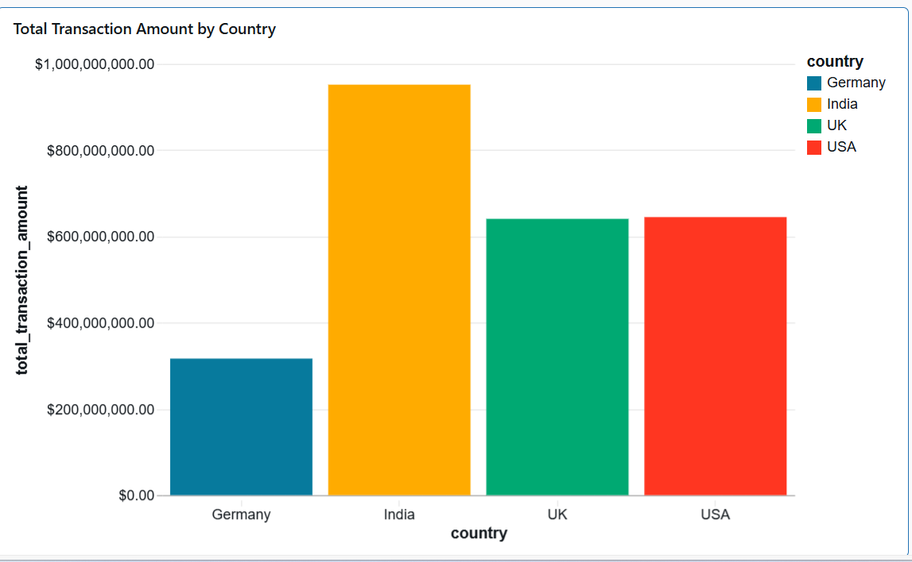
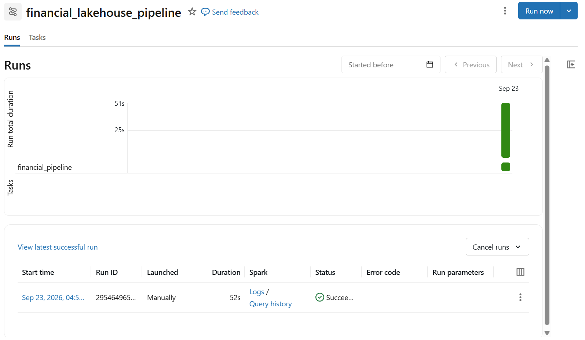
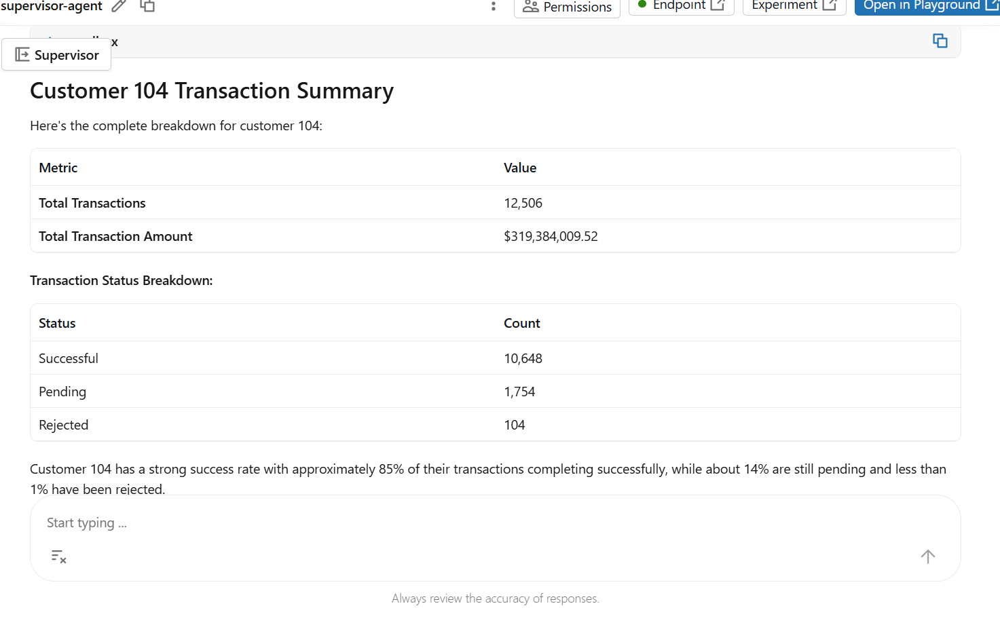

# Financial Lakehouse & AI Copilot

An end-to-end financial data engineering and AI project built using **Databricks, PySpark, Delta Lake, Unity Catalog, and Databricks Agents**.

The project processes financial transaction data through a **Bronze → Silver → Gold** lakehouse architecture, performs data-quality validation and incremental processing, generates business KPIs, and provides a natural-language interface for querying structured financial data through a Databricks Supervisor Agent.

## Business Problem

Financial transaction data needs to be:

- Cleaned and validated before analysis
- Incrementally processed as new data arrives
- Stored in reliable and queryable tables
- Transformed into business-level KPIs
- Accessible to users without requiring them to write SQL queries

This project demonstrates how Databricks can be used to build a complete financial data pipeline and an AI-powered interface on top of the processed data.
## Architecture

```text
Financial Transaction Data
          │
          ▼
    Bronze Layer
   Raw Delta Table
          │
          ▼
   Data Quality Checks
          │
          ▼
    Silver Layer
 Cleaned & Validated Data
          │
          ▼
     Delta MERGE
 Incremental Processing
          │
          ▼
     Gold Layer
   Business KPIs
          │
          ├──────────────► Databricks SQL Dashboard
          │
          ▼
     Unity Catalog
          │
          ▼
   Supervisor Agent
          │
          ▼
Natural Language Queries
```


**Technology Stack**
Databricks
PySpark
Delta Lake
Unity Catalog
Databricks Jobs
Databricks SQL
Supervisor Agent

## Implementation

### 1. Bronze Layer

Created a Bronze Delta table to store the raw financial transaction data.

The dataset contains more than 100,000 financial transactions with fields such as:

- Transaction ID
- Customer ID
- Transaction date
- Product
- Transaction amount
- Transaction status
- Country

---

### 2. Data Quality Validation

Implemented data-quality checks before creating the Silver layer.

The pipeline validates:

- Null customer IDs
- Negative transaction amounts
- Invalid transaction statuses
- Duplicate transaction IDs

Invalid records are removed before the data is promoted to the Silver layer.

---

### 3. Silver Layer

Created a cleaned and validated Silver Delta table.

Transformations include:

- Removing records with null customer IDs
- Removing negative transaction amounts
- Validating transaction status values
- Removing duplicate transaction IDs

The resulting dataset contains **100,011 valid transactions**.

---

### 4. Incremental Processing

Implemented incremental processing using **Delta Lake MERGE**.

New daily transaction data is cleaned and merged into the Silver table.

This allows the pipeline to handle:

- New transactions
- Updated transactions
- Duplicate records

without rebuilding the entire dataset.

---

### 5. Gold Layer

Created business-level KPI tables from the Silver data.

Key metrics include:

- Total transaction amount
- Transaction count
- Average transaction amount
- Country-level transaction analysis
- Product-level transaction analysis
- Transaction success rate

---

### 6. Databricks Job

Automated the pipeline using **Databricks Jobs**.

The job executes the financial pipeline from data processing through Gold-layer KPI generation.

A scheduled trigger can be configured to execute the pipeline automatically at a defined time.

---

### 7. Databricks SQL Dashboard

Created visualizations to monitor financial KPIs.

The dashboard provides visibility into:

- Transaction volume
- Transaction amounts
- Country-level performance
- Average transaction values
- Transaction success rate

---

### 8. AI Copilot

Configured a **Databricks Supervisor Agent** with access to the Unity Catalog financial transaction table.
## Project Notebook

### Financial Transaction Pipeline

The main Databricks notebook contains the complete financial lakehouse pipeline:

* Financial transaction data generation
* Bronze Delta layer
* Data-quality validation
* Silver data cleaning and validation
* Day-2 incremental data processing
* Delta Lake MERGE for inserts and updates
* Gold-layer country KPIs
* Gold-layer product KPIs

[View `financial_transaction_pipeline.py`](notebooks/financial_transaction_pipeline.py)


## Project Results

- Processed **100K+ financial transactions** using PySpark and Delta Lake.
- Implemented data-quality validation for nulls, duplicates, invalid statuses, and negative amounts.
- Implemented incremental processing using **Delta Lake MERGE** for daily transaction updates.
- Created Gold-layer financial KPIs for business analysis.
- Automated the data pipeline using **Databricks Jobs**.
- Organized data assets using **Unity Catalog**.
- Built a Databricks SQL dashboard for financial KPI analysis.
- Configured a **Supervisor Agent** to query structured financial data using natural language.

## Key Databricks Concepts Demonstrated

- Bronze-Silver-Gold architecture
- Delta Lake
- Delta MERGE
- PySpark transformations
- Data quality validation
- Incremental data processing
- Unity Catalog
- Databricks Jobs
- Job scheduling
- Databricks SQL
- Supervisor Agents
- Natural-language querying

## Project Limitations

The financial dataset used in this project is synthetic and was created for learning and demonstration purposes.

Document-based RAG was explored conceptually and through Databricks Knowledge Assistant configuration. The workspace's managed embedding service was unavailable, so a fully functional document-retrieval workflow was not included as a completed implementation.

The agent allows users to ask questions in natural language instead of writing SQL.

Example:

> How many transactions does customer 104 have?

The agent can query the structured financial data and return the relevant result.

## Project Screenshots

### Financial Transaction Dashboard

Country-wise transaction analysis showing total transaction amount by country.



### Databricks Job

Financial data pipeline executed using Databricks Jobs.



### Supervisor Agent

Natural-language querying of financial transaction data using a Databricks Supervisor Agent.



